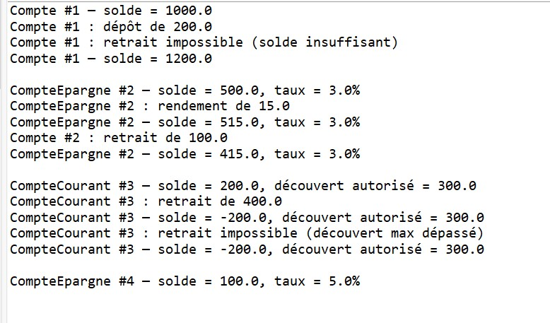
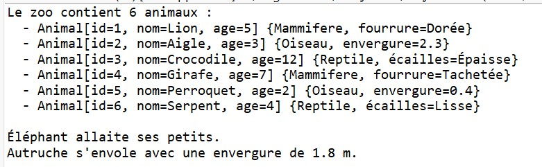
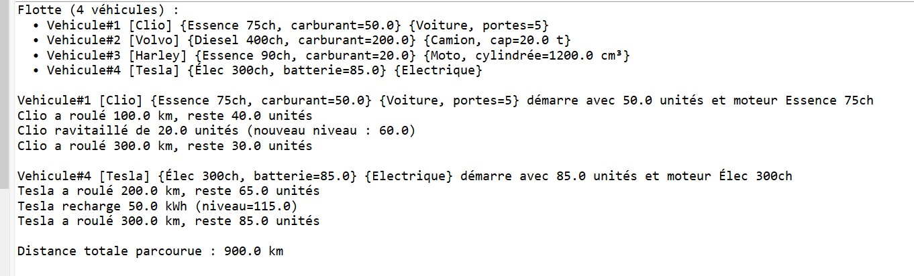
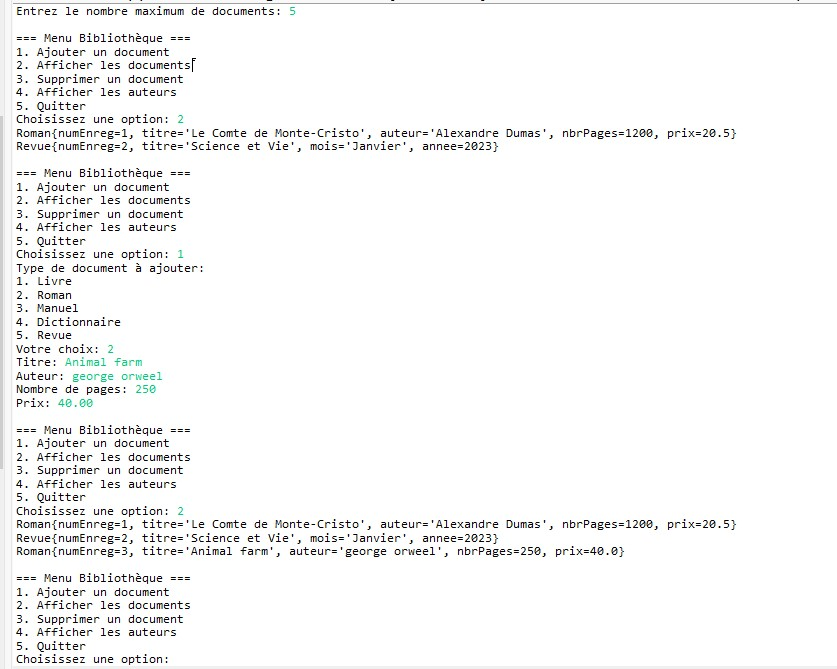

# TP Java – Exercices sur l’Héritage et la Gestion Dynamique d’Objets

## Exercice 1 : Hiérarchie de comptes bancaires

### Description
Ce projet illustre l’héritage en Java à travers une hiérarchie de classes représentant des comptes bancaires.  
Une classe de base `Compte` est étendue par deux sous-classes spécialisées :
- `CompteEpargne`, qui ajoute un taux d’intérêt  
- `CompteCourant`, qui permet un découvert autorisé

### Fonctionnalités
1. Création de comptes avec numéro automatique et solde initial  
2. Gestion des dépôts et retraits  
3. Application des intérêts (Compte Épargne)  
4. Retraits avec découvert (Compte Courant)  
5. Illustration du polymorphisme avec `Compte poly = new CompteEpargne(...)`

### Résultats du programme

---

## Exercice 2 : Gestion d’un zoo avec héritage et tableau dynamique d’animaux

### Description
Ce projet met en œuvre l’héritage et la composition pour gérer un zoo.  
Une hiérarchie d’animaux (`Animal`, `Mammifere`, `Oiseau`, `Reptile`) est manipulée par la classe `Zoo`, qui stocke dynamiquement les instances dans un tableau extensible.

### Fonctionnalités
1. Ajout automatique d’animaux avec extension du tableau  
2. Redéfinition de `toString()` pour chaque type d’animal  
3. Appels polymorphes aux méthodes spécifiques (`voler()`, `allaiter()`, `seChauffer()`)  
4. Affichage global de tous les animaux du zoo  

### Résultats du programme

---

## Exercice 3 : Parc de véhicules – Héritage, composition et gestion de flotte

### Objectif
Modéliser un parc de véhicules en Java avec :
- Une hiérarchie de classes multi-niveaux : `Vehicule → Motorise → Voiture, Camion, Moto, VoitureElectrique`  
- Une classe de composition `Moteur`  
- Gestion du carburant ou de la batterie sans lever d’exceptions  
- Une classe `Flotte` qui stocke dynamiquement les véhicules et calcule des statistiques  

### Prérequis
- JDK 8 ou ultérieur  
- IDE (Eclipse, IntelliJ, VS Code…) ou éditeur + terminal  
- Connaissances de base : classes, héritage, tableaux, boucles, méthodes  

### Modélisation conceptuelle
- **Vehicule** : identifiant unique, modèle  
- **Motorise** : moteur, niveau de carburant/batterie, distance parcourue, méthodes de conduite et de ravitaillement  
- **Voiture, Camion, Moto, VoitureElectrique** : spécialisations avec comportements spécifiques (klaxonner, charger, wheelie, recharger)  
- **Flotte** : tableau dynamique de véhicules, calcul de la distance totale parcourue  

### Fonctionnalités
1. Ajout de véhicules dans la flotte avec extension automatique du tableau  
2. Démonstration de la conduite et consommation de carburant  
3. Gestion spécifique pour véhicules électriques  
4. Calcul et affichage de la distance totale parcourue par tous les véhicules  

### Résultats du programme

---

## Exercice 4 : Gestion d'une Bibliothèque

### Description
Ce projet consiste à modéliser une bibliothèque en Java.  
Une bibliothèque est représentée par un tableau de documents, et chaque document est une instance d’une classe du package `entities`.  
Les principes de **POO** comme l’encapsulation et le polymorphisme sont respectés, et la méthode `toString()` est redéfinie pour chaque classe.  
Chaque document possède un numéro d’enregistrement `numEnreg` auto-incrémenté.

### Fonctionnalités
1. Création d’une bibliothèque avec une capacité maximale de documents  
2. Ajout et suppression de documents  
3. Recherche d’un document par numéro d’enregistrement  
4. Affichage de tous les documents  
5. Affichage de la liste des auteurs présents dans la bibliothèque  
6. Classe de test dans le package `test` avec menu interactif permettant de :
   - Ajouter un document  
   - Supprimer un document  
   - Afficher tous les documents  
   - Afficher les auteurs  
   - Quitter le programme  

### Résultats du programme

---

### Conclusion générale
Ces quatre exercices montrent :
- L’utilisation de l’**héritage et du polymorphisme** en Java  
- La gestion de **tableaux dynamiques** pour stocker des objets  
- La **composition** et la **modélisation d’objets complexes**  
- L’illustration concrète des concepts fondamentaux de la **programmation orientée objet (POO)**
